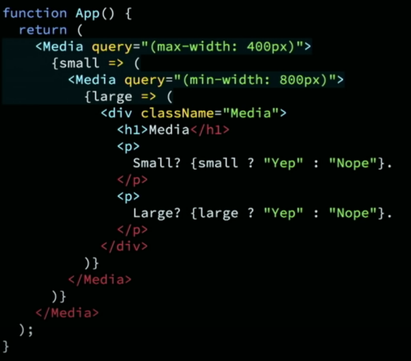
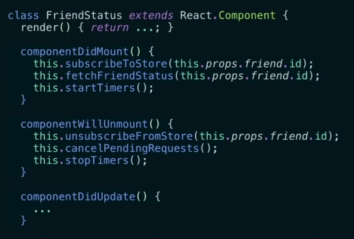
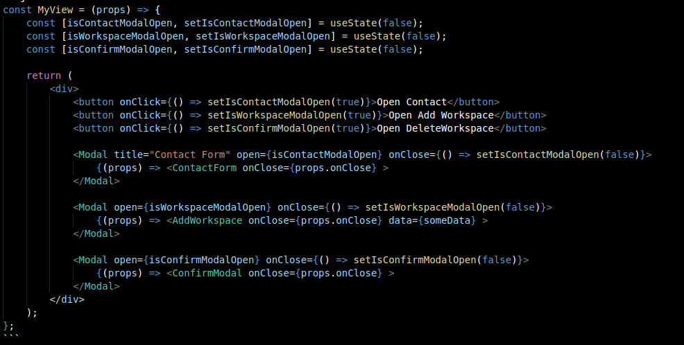
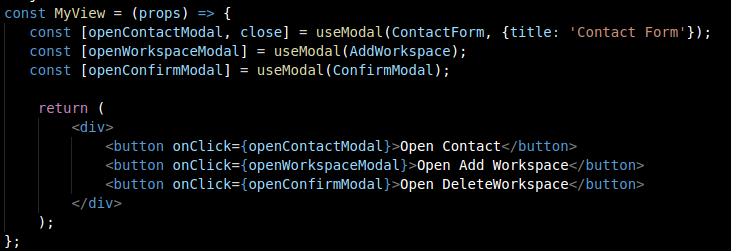

# Why Hooks? 

Note:
* Take this presentation as a "grain of salt". Im not trying to force change but maybe to "Start a conversation on it".
* This is the way react and the community are headed. 
* That is something we could take advantage and apply in our own projects. As I understand we do use it, but maybe not enough

---

# Why?

Issues in react 2018
* Wrapper hell
* Syntax confusion
* Reusability in components
* Classes are hard for humans and machines

----

## Wrapper Hell

* Higher Order Components HOC
* Render Props

> A picture is worth a thousand words

----

## Syntax confusion 
* React is lying to us
* Cluttered code

----

## Reusability in components
* It can be difficult to reuse logic in class components

Note: 
* Mixins used to be an option, but react team went away from it

----

## Classes are hard for humans and robots
* this
* stateless functions components -> class components
* compiler issues 

---

### React hooks in one 10s

<video controls width="400">
    <source src="https://video.twimg.com/tweet_video/DqsCilOU0AAoS7P.mp4" type="video/mp4">
</video>

---

# Coding time
Where can we apply hooks in our projects

* Transforming Class Components into hooks
* Modals (let's see it)

----

#### Modals
Now, we are doing something like this

Note: 
* For simplicity, I wont explain every aspect of it
* There are a few modals in portal-app and sometimes a view can manage multiple modals
* Modal is lying to us
* A lot of boilerplate 

----

Note: 
* We dont manage the state, the hook does
* We dont need to make the component part of the react tree

---

# REFERENCES
* [github.com/ajorquera/why-hooks](https://github.com/ajorquera/why-hooks)
* [Video React Conf 2018](https://www.youtube.com/watch?v=dpw9EHDh2bM)
* [React official docs](https://reactjs.org/docs/hooks-intro.html)
* [Making Sense of React Hooks](https://medium.com/@dan_abramov/making-sense-of-react-hooks-fdbde8803889) - Dan Abramov. Co-author Redux and Create React App

---

# Conclusion

Note: 
* Programming Principles SOLID, KISS, DRY
* I want to use PULL not push. 

